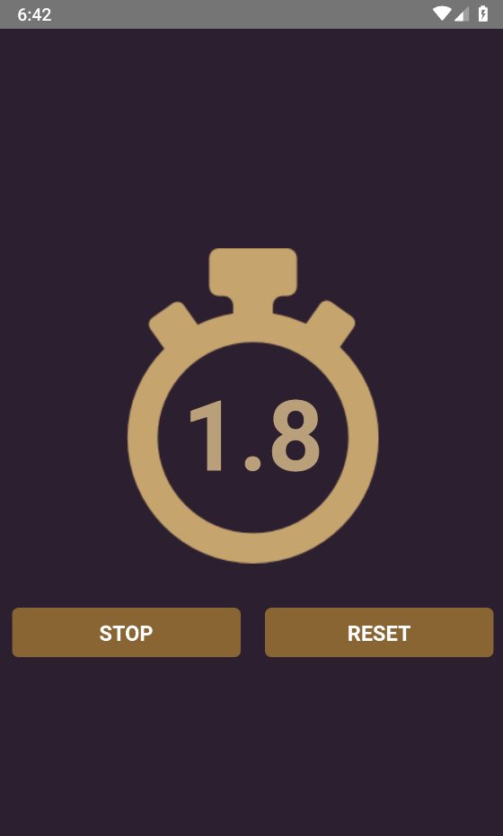
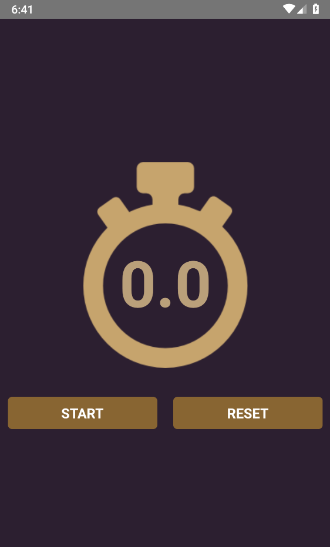

# Cronômetro
Projeto 3/4 de React Native Básico

## Explicação do Aplicativo 
Aplicativo simples de cronômetro

 
   
  

 

**Versão 1.0** 
## Contributors 
- Raphael Satomi G. de Andrade <raphaelsatomiandrade@gmail.com>
